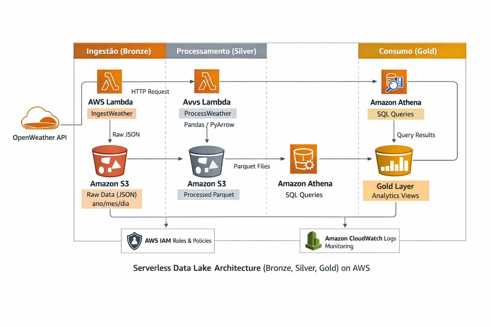
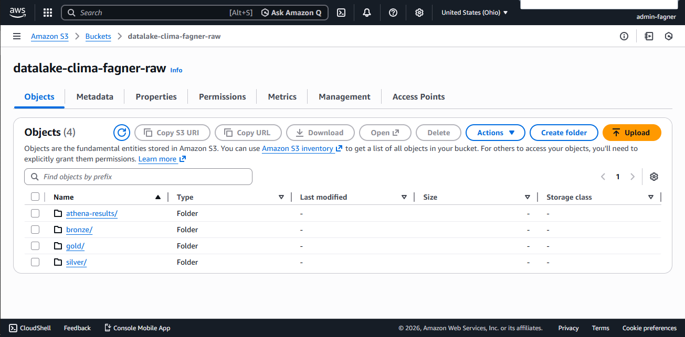
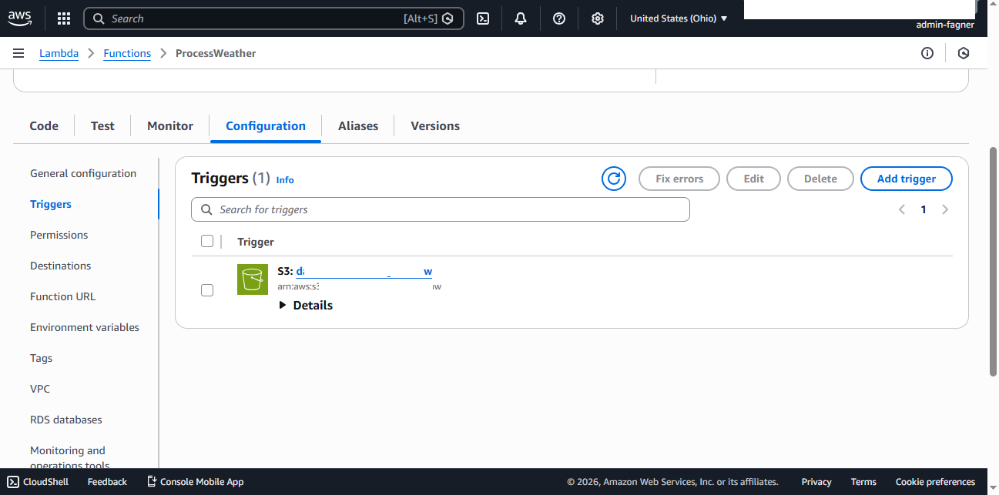
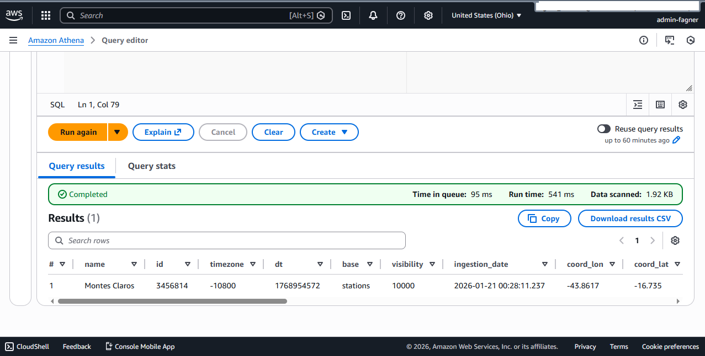

# 🌦️ AWS Serverless Data Lake (End-to-End)




Este projeto é um **Data Lakehouse** completo e *serverless* construído na AWS. O pipeline realiza a ingestão de dados meteorológicos em tempo real via API, processa e refina as informações utilizando Python (Pandas) e disponibiliza os dados para Analytics via SQL (Athena), seguindo a **Arquitetura Medalhão**.

---

## 🏗️ Arquitetura da Solução

O projeto utiliza uma arquitetura orientada a eventos (**Event-Driven**) para garantir baixo custo e processamento em tempo real.



1.  **Ingestão (Extract - Bronze Layer):**
    * **AWS Lambda (`IngestWeather`):** Consumo da API OpenWeatherMap.
    * **Timezone Aware:** Tratamento de fuso horário (UTC -> BRT) para particionamento correto.
    * **Storage:** Armazenamento do JSON bruto no **Amazon S3** (`/bronze`).
2.  **Transformação (Transform - Silver Layer):**
    * **Gatilho Automático:** O upload na camada Bronze dispara o próximo Lambda (S3 Event Notifications).

    

    * **AWS Lambda (`ProcessWeather`):** Processamento robusto com **Pandas** (via Lambda Layer).
    * **Flattening:** Conversão de JSONs aninhados para estrutura tabular.
    * **Otimização:** Conversão para formato colunar **Parquet** (compressão Snappy) e higienização de nomes de colunas.
3.  **Analytics (Load/Serve - Gold Layer):**
    * **Amazon Athena:** Tabela externa mapeada sobre os arquivos Parquet.
    * **Serverless SQL:** Consultas *Ad-hoc* sem necessidade de servidores de banco de dados.

---

## 🚀 Como Executar

### Pré-requisitos
* Conta na [AWS](https://aws.amazon.com/) (Free Tier elegível).
* Chave de API da [OpenWeatherMap](https://openweathermap.org/).
* [Python 3.x](https://www.python.org/) instalado.

### 1. Configuração de Infraestrutura (AWS Console)
1.  Crie um **Bucket S3** (ex: `datalake-clima-seu-nome`).
2.  Crie uma **IAM Role** com permissões de leitura/escrita no S3 e execução de Lambda.
3.  Configure as Funções Lambda com o código disponível na pasta `/src`.

### 2. Configuração de Variáveis de Ambiente
Nos Lambdas, configure as seguintes variáveis de ambiente (Environment Variables) para segurança (evitando senhas no código):

```env
OPENWEATHER_API_KEY='sua_chave_da_api'
BUCKET_NAME='nome-do-seu-bucket-s3'
CITY_NAME='Montes Claros'
```

## 🚀 3. Deploy e Execução

Como é uma arquitetura **serverless**, o deploy é feito atualizando os códigos nas funções **AWS Lambda**.

### ▶️ Como iniciar o fluxo

Você pode iniciar o pipeline de duas formas:

- Executar um teste manual na função **IngestWeather** (botão **Test** no console da AWS)
- Configurar um **Amazon EventBridge Scheduler** para rodar automaticamente a cada hora

---

## 📊 Estrutura de Análise (SQL Athena)

Após o processamento, os dados ficam disponíveis no **Amazon Athena** através da tabela:

### 🗄️ `tbl_clima`

| Coluna           | Descrição                                                                 |
|------------------|---------------------------------------------------------------------------|
| `name`          | Nome da cidade coletada                                                   |
| `main_temp`    | Temperatura atual (°C)                                                   |
| `main_humidity`| Umidade relativa do ar (%)                                               |
| `ingestion_date` | Timestamp exato da coleta                                              |
| `partition`    | Particionamento Hive (ano, mês, dia) para otimização de queries         |

---

## 📈 Visualização (Analytics Results)

Aqui está um exemplo de consulta SQL exploratória executada diretamente no Athena, consumindo os dados da camada **Silver (Parquet)**:



### 🔍 Query de Exemplo

```sql
SELECT 
    name, 
    main_temp, 
    main_humidity, 
    from_unixtime(dt) 
FROM db_clima_fagner.tbl_clima 
WHERE main_temp > 20 
ORDER BY ingestion_date DESC;
```

## 🔮 Roadmap e Melhorias Futuras

Este projeto implementa uma arquitetura robusta (**MVP**), mas há espaço para evolução rumo a um cenário **Enterprise (v2.0)**:

### 🏗️ Infraestrutura como Código (IaC)
- Substituir a criação manual no console por **Terraform** ou **AWS SAM**
- Permitir versionamento e reprodutibilidade da infraestrutura

### 📊 Visualização de Dados (BI)
- Conectar o **Amazon QuickSight** ao **Athena**
- Criar dashboards dinâmicos de variação de temperatura e alertas meteorológicos

### 🔍 Observabilidade
- Configurar **CloudWatch Alarms**
- Notificações por e-mail em caso de falha ou timeout nas funções Lambda

### 🔄 CI/CD
- Implementar **GitHub Actions**
- Deploy automático dos códigos Python na AWS a cada push na branch `main`

---

## 📞 Contato

**Fagner Rezende**  
Engenharia de Dados | Python | SQL | ETL | Analytics  

📧 Email: fagner_rezende@hotmail.com  
💼 LinkedIn: [https://www.linkedin.com/in/fagnerabrezende](https://www.linkedin.com/in/fagnerabrezende)  
🐙 GitHub: [https://github.com/Fagner-rezende](https://github.com/Fagner-rezende)
